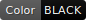
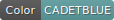
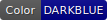
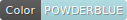

# AnyBadge.NET
A .NET port of https://github.com/jongracecox/anybadge written in F#.

Available named colors are:

| Color Name           | Hex     | Example |
| -------------------- | ------- | ------- |
| aliceblue            | #F0F8FF |  |
| antiquewhite         | #FAEBD7 |  |
| aqua                 | #00FFFF |  |
| aquamarine           | #7FFFD4 |  |
| azure                | #F0FFFF |  |
| beige                | #F5F5DC |  |
| bisque               | #FFE4C4 |  |
| black                | #000000 |  |
| blanchedalmond       | #FFEBCD |  |
| blue                 | #0000FF |  |
| blueviolet           | #8A2BE2 |  |
| bright_red           | #FF0000 |  |
| bright_yellow        | #FFFF00 |  |
| brown                | #A52A2A |  |
| burlywood            | #DEB887 |  |
| cadetblue            | #5F9EA0 |  |
| chartreuse           | #7FFF00 |  |
| chocolate            | #D2691E |  |
| coral                | #FF7F50 |  |
| cornflowerblue       | #6495ED |  |
| cornsilk             | #FFF8DC |  |
| crimson              | #DC143C |  |
| darkblue             | #00008B |  |
| darkcyan             | #008B8B |  |
| darkgoldenrod        | #B8860B |  |
| darkgray             | #A9A9A9 |  |
| darkgreen            | #006400 |  |
| darkkhaki            | #BDB76B |  |
| darkmagenta          | #8B008B |  |
| darkolivegreen       | #556B2F |  |
| darkorange           | #FF8C00 |  |
| darkorchid           | #9932CC |  |
| darkred              | #8B0000 |  |
| darksalmon           | #E9967A |  |
| darkseagreen         | #8FBC8F |  |
| darkslateblue        | #483D8B |  |
| darkslategray        | #2F4F4F |  |
| darkturquoise        | #00CED1 |  |
| darkviolet           | #9400D3 |  |
| deeppink             | #FF1493 |  |
| deepskyblue          | #00BFFF |  |
| dimgray              | #696969 |  |
| dodgerblue           | #1E90FF |  |
| firebrick            | #B22222 |  |
| floralwhite          | #FFFAF0 |  |
| forestgreen          | #228B22 |  |
| fuchsia              | #FF00FF |  |
| gainsboro            | #DCDCDC |  |
| ghostwhite           | #F8F8FF |  |
| gold                 | #FFD700 |  |
| goldenrod            | #DAA520 |  |
| gray                 | #808080 |  |
| green                | #4C1    |  |
| greenyellow          | #ADFF2F |  |
| green_2              | #008000 |  |
| honeydew             | #F0FFF0 |  |
| hotpink              | #FF69B4 |  |
| indianred            | #CD5C5C |  |
| indigo               | #4B0082 |  |
| ivory                | #FFFFF0 |  |
| khaki                | #F0E68C |  |
| lavender             | #E6E6FA |  |
| lavenderblush        | #FFF0F5 |  |
| lawngreen            | #7CFC00 |  |
| lemonchiffon         | #FFFACD |  |
| lightblue            | #ADD8E6 |  |
| lightcoral           | #F08080 |  |
| lightcyan            | #E0FFFF |  |
| lightgoldenrodyellow | #FAFAD2 |  |
| lightgray            | #D3D3D3 |  |
| lightgreen           | #90EE90 |  |
| lightpink            | #FFB6C1 |  |
| lightsalmon          | #FFA07A |  |
| lightseagreen        | #20B2AA |  |
| lightskyblue         | #87CEFA |  |
| lightslategray       | #778899 |  |
| lightsteelblue       | #B0C4DE |  |
| lightyellow          | #FFFFE0 |  |
| light_grey           | #9F9F9F |  |
| lime                 | #00FF00 |  |
| limegreen            | #32CD32 |  |
| linen                | #FAF0E6 |  |
| maroon               | #800000 |  |
| mediumaquamarine     | #66CDAA |  |
| mediumblue           | #0000CD |  |
| mediumorchid         | #BA55D3 |  |
| mediumpurple         | #9370DB |  |
| mediumseagreen       | #3CB371 |  |
| mediumslateblue      | #7B68EE |  |
| mediumspringgreen    | #00FA9A |  |
| mediumturquoise      | #48D1CC |  |
| mediumvioletred      | #C71585 |  |
| midnightblue         | #191970 |  |
| mintcream            | #F5FFFA |  |
| mistyrose            | #FFE4E1 |  |
| moccasin             | #FFE4B5 |  |
| navajowhite          | #FFDEAD |  |
| navy                 | #000080 |  |
| oldlace              | #FDF5E6 |  |
| olive                | #808000 |  |
| olivedrab            | #6B8E23 |  |
| orange               | #FE7D37 |  |
| orangered            | #FF4500 |  |
| orange_2             | #FFA500 |  |
| orchid               | #DA70D6 |  |
| palegoldenrod        | #EEE8AA |  |
| palegreen            | #98FB98 |  |
| paleturquoise        | #AFEEEE |  |
| palevioletred        | #DB7093 |  |
| papayawhip           | #FFEFD5 |  |
| peachpuff            | #FFDAB9 |  |
| peru                 | #CD853F |  |
| pink                 | #FFC0CB |  |
| plum                 | #DDA0DD |  |
| powderblue           | #B0E0E6 |  |
| purple               | #800080 |  |
| rebeccapurple        | #663399 |  |
| red                  | #E05D44 |  |
| rosybrown            | #BC8F8F |  |
| royalblue            | #4169E1 |  |
| saddlebrown          | #8B4513 |  |
| salmon               | #FA8072 |  |
| sandybrown           | #F4A460 |  |
| seagreen             | #2E8B57 |  |
| seashell             | #FFF5EE |  |
| sienna               | #A0522D |  |
| silver               | #C0C0C0 |  |
| skyblue              | #87CEEB |  |
| slateblue            | #6A5ACD |  |
| slategray            | #708090 |  |
| snow                 | #FFFAFA |  |
| springgreen          | #00FF7F |  |
| steelblue            | #4682B4 |  |
| tan                  | #D2B48C |  |
| teal                 | #008080 |  |
| thistle              | #D8BFD8 |  |
| tomato               | #FF6347 |  |
| turquoise            | #40E0D0 |  |
| violet               | #EE82EE |  |
| wheat                | #F5DEB3 |  |
| white                | #FFFFFF |  |
| whitesmoke           | #F5F5F5 |  |
| yellow               | #DFB317 |  |
| yellowgreen          | #9ACD32 |  |
| yellow_green         | #A4A61D |  |
